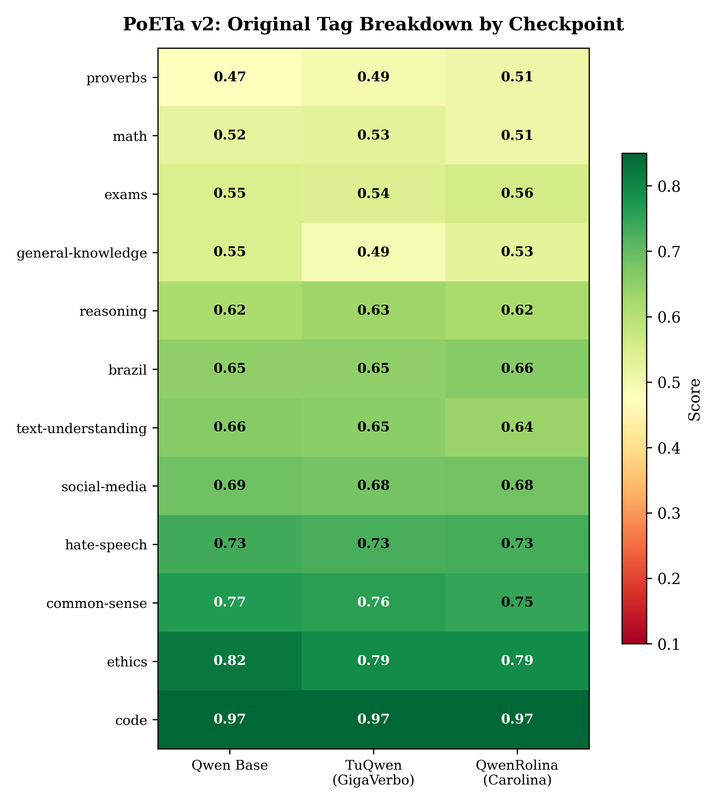
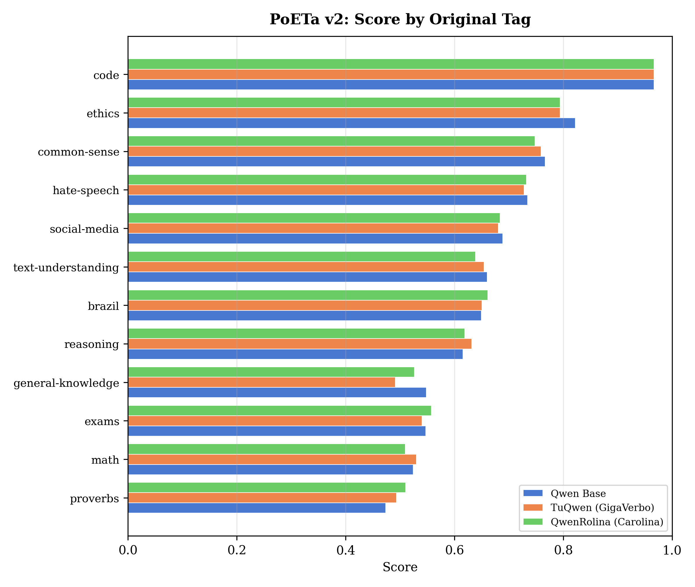

# brasa-eval

Toolkit para avaliacao diagnostica de LLMs em portugues usando o benchmark PoETa v2.

Desenvolvido para suportar um short paper STIL/BRACIS 2026 que investiga como o continued pretraining em portugues afeta o desempenho de modelos Qwen 1.7B em tarefas nativas vs. traduzidas, e como scores agregados escondem trade-offs relevantes entre categorias de capacidade.

---

## Contexto cientifico

Benchmarks agregados (e.g., um unico score no leaderboard) mascaram diferencas importantes no comportamento de LLMs. Este estudo usa o PoETa v2 — um benchmark diagnostico com 40 tarefas em portugues — para responder:

1. **O continued pretraining em portugues melhora tarefas nativas?** Sim, mas de forma modesta (+0.4 pp em Native score) enquanto o desempenho em tarefas traduzidas cai (-0.9 a -1.3 pp).
2. **Qual corpus de treinamento e mais efetivo?** O GigaVerbo (100B tokens) produz ganhos mais equilibrados que o Carolina (200M tokens), que favorece tarefas culturais brasileiras mas perde mais em tarefas traduzidas.
3. **O score agregado captura essas diferencas?** Nao — a variacao no All score e de apenas 0.75 pp entre os tres checkpoints, escondendo movimentos opostos em Native e Translated.

---

## Modelos avaliados

Tres checkpoints do Qwen 1.7B com diferentes estrategias de continued pretraining:

| Modelo | HuggingFace ID | Treinamento | Corpus |
|--------|---------------|-------------|--------|
| **Qwen 1.7B Base** | [`Qwen/Qwen3-1.7B-Base`](https://huggingface.co/Qwen/Qwen3-1.7B-Base) | Nenhum (baseline) | — |
| **TuQwen (GigaVerbo)** | [`ggg-llms-team/TuQwen3-Base-LR1e5-run1`](https://huggingface.co/ggg-llms-team/TuQwen3-Base-LR1e5-run1) | Continued pretraining, 1 epoch | GigaVerbo (100B tokens) |
| **QwenRolina (Carolina)** | [`g4me/QwenRolina3-Base-LR1e5-b32g2gc8-order-domain`](https://huggingface.co/g4me/QwenRolina3-Base-LR1e5-b32g2gc8-order-domain) | Continued pretraining, 1 epoch | Carolina (200M tokens) |

Os resultados de avaliacao foram obtidos do repositorio privado [`C4AI/TuQwen-eval-PoETaV2`](https://github.com/C4AI/TuQwen-eval-PoETaV2) e convertidos via `scripts/import_poetav2_results.py`.

---

## Resultados

### Scores agregados (All / Native / Translated)

| Checkpoint | All | Native (14) | Translated (26) |
|:-----------|:---:|:-----------:|:---------------:|
| **Qwen 1.7B Base** | **0.6655** | 0.6862 | **0.6544** |
| **TuQwen (GigaVerbo)** | 0.6609 | **0.6902** | 0.6451 |
| **QwenRolina (Carolina)** | 0.6580 | 0.6891 | 0.6412 |

**Observacoes:**
- O All score varia apenas 0.75 pp entre checkpoints — insuficiente para distinguir os modelos.
- O Native score sobe consistentemente apos continued pretraining (+0.29 pp para QwenRolina, +0.40 pp para TuQwen), indicando que ambos os corpora beneficiam tarefas em portugues nativo.
- O Translated score cai em ambos os modelos treinados (-0.93 pp para TuQwen, -1.32 pp para QwenRolina), sugerindo trade-off entre capacidade em portugues e desempenho em tarefas traduzidas do ingles.

### Breakdown por categoria

As 40 tarefas sao agrupadas manualmente em 6 categorias diagnosticas orientadas a interpretabilidade (manual capability grouping). O PoETa v2 original possui subcategorias multi-rotulo; este paper colapsa essas subcategorias em buckets mais amplos, atribuindo cada task ao bucket que melhor representa seu sinal diagnostico dominante.

| Categoria | # Tasks | Qwen Base | TuQwen (GigaVerbo) | QwenRolina (Carolina) |
|:----------|:-------:|:---------:|:------------------:|:---------------------:|
| Brazil / exams / culture | 6 | 0.6228 | 0.6300 | **0.6461** |
| Text understanding / QA / classification | 11 | **0.7192** | 0.7016 | 0.6947 |
| Social / safety | 6 | **0.7328** | 0.7181 | 0.7204 |
| Reasoning | 12 | 0.6262 | **0.6286** | 0.6228 |
| Math | 4 | 0.5238 | **0.5299** | 0.5096 |
| Code / other | 1 | 0.9667 | 0.9667 | 0.9667 |

**Observacoes:**
- **Brazil / exams / culture**: QwenRolina (+2.33 pp vs base) supera TuQwen (+0.72 pp). O Carolina, apesar de menor, contem conteudo cultural brasileiro que beneficia ENEM, BLUEX e BRoverbs.
- **Text understanding / QA / classification**: O base Qwen e o melhor. O continued pretraining reduz desempenho em tarefas de compreensao textual traduzidas (queda de -1.76 pp para TuQwen, -2.45 pp para QwenRolina).
- **Social / safety**: Mesma tendencia — o base lidera. Apesar de a maioria das tarefas ser nativa (4 Native + 2 Translated), o continued pretraining nao melhora deteccao de toxicidade.
- **Reasoning e Math**: TuQwen apresenta leve vantagem, consistente com o GigaVerbo sendo um corpus maior e mais diverso.
- **Code / other**: Efeito teto — todos atingem 96.7% na unica tarefa (BB Code Line Description).

### Top mudancas por tarefa (vs. Qwen Base)

#### Qwen Base -> TuQwen (efeito do GigaVerbo, 100B tokens)

| Tarefa | Base | TuQwen | Delta |
|:-------|:----:|:------:|:-----:|
| BB Empirical Judgments | 0.545 | 0.606 | +0.061 |
| BB Mathematical Induction | 0.657 | 0.714 | +0.057 |
| BRoverbs History->Proverb | 0.517 | 0.553 | +0.037 |
| Balanced COPA | 0.817 | 0.850 | +0.033 |
| BB Analogical Similarity | 0.253 | 0.277 | +0.023 |
| BoolQ | 0.667 | 0.520 | -0.147 |
| AGIEval SAT Math | 0.518 | 0.482 | -0.036 |
| IMDb | 0.903 | 0.870 | -0.033 |
| WSC-285 | 0.632 | 0.600 | -0.032 |
| BB BBQ | 0.757 | 0.727 | -0.030 |

**Padrao:** O GigaVerbo melhora raciocinio (BB Mathematical Induction +5.7 pp, Balanced COPA +3.3 pp) e tarefas culturais (BRoverbs +3.7 pp). As perdas concentram-se em tarefas traduzidas de compreensao (BoolQ -14.7 pp, IMDb -3.3 pp).

#### Qwen Base -> QwenRolina (efeito do Carolina, 200M tokens)

| Tarefa | Base | QwenRolina | Delta |
|:-------|:----:|:----------:|:-----:|
| BB Empirical Judgments | 0.545 | 0.626 | +0.081 |
| Enem 2022 | 0.585 | 0.627 | +0.042 |
| BRoverbs History->Proverb | 0.517 | 0.553 | +0.037 |
| BRoverbs Proverb->History | 0.430 | 0.467 | +0.037 |
| Math MC | 0.520 | 0.553 | +0.033 |
| IMDb | 0.903 | 0.830 | -0.073 |
| BB Mathematical Induction | 0.657 | 0.600 | -0.057 |
| StoryCloze | 0.903 | 0.847 | -0.057 |
| Faquad | 0.838 | 0.789 | -0.050 |
| BB BBQ | 0.757 | 0.710 | -0.047 |

**Padrao:** O Carolina destaca-se em tarefas culturais brasileiras (Enem 2022 +4.2 pp, BRoverbs +3.7 pp) mas tem perdas mais acentuadas em tarefas traduzidas (IMDb -7.3 pp, StoryCloze -5.7 pp, BB Mathematical Induction -5.7 pp).

#### Comparacao entre corpora

O GigaVerbo (100B tokens) e o Carolina (200M tokens) produzem perfis de ganho distintos:
- **Tarefas culturais brasileiras**: Carolina e superior (Enem 2022 +4.2 pp vs +0.85 pp do GigaVerbo; BRoverbs Proverb->History +3.7 pp vs +0.33 pp).
- **Raciocinio**: GigaVerbo e superior (BB Mathematical Induction +5.7 pp vs -5.7 pp do Carolina).
- **Custo em tarefas traduzidas**: Carolina perde mais (IMDb -7.3 pp vs -3.3 pp; StoryCloze -5.7 pp vs -2.7 pp).
- Ambos compartilham a queda em BB BBQ (-3.0 pp TuQwen, -4.7 pp QwenRolina). A queda em BoolQ e exclusiva do TuQwen (-14.7 pp); QwenRolina mantem o mesmo score do base (0.0 pp).

### Drill-down: ENEM 2022 e BLUEX por subarea

Para entender onde exatamente os ganhos e perdas ocorrem dentro da categoria Brazil / Exams, quebramos os resultados de ENEM 2022 e BLUEX por subarea tematica. (O ENEM classico so possui split por ano, sem subareas.)

#### ENEM 2022

| Subarea | Qwen Base | TuQwen | QwenRolina | Delta TuQwen | Delta QwenRolina |
|:--------|:---------:|:------:|:----------:|:------------:|:----------------:|
| Human Sciences | 0.7027 | 0.7297 | 0.7297 | +2.7 pp | +2.7 pp |
| Natural Sciences | 0.5769 | 0.6154 | 0.6923 | +3.9 pp | **+11.5 pp** |
| Languages | 0.7576 | 0.6970 | 0.7273 | -6.1 pp | -3.0 pp |
| Mathematics | 0.1364 | 0.1818 | 0.2273 | +4.5 pp | **+9.1 pp** |

#### BLUEX

| Subarea | Qwen Base | TuQwen | QwenRolina | Delta TuQwen | Delta QwenRolina |
|:--------|:---------:|:------:|:----------:|:------------:|:----------------:|
| Biology | 0.6867 | 0.7349 | 0.7831 | +4.8 pp | **+9.6 pp** |
| History | 0.6792 | 0.7107 | 0.7107 | +3.1 pp | +3.1 pp |
| Geography | 0.6053 | 0.6053 | 0.6579 | 0.0 pp | +5.3 pp |
| English | 0.6571 | 0.6143 | 0.6714 | -4.3 pp | +1.4 pp |
| Philosophy | 0.6364 | 0.6364 | 0.5909 | 0.0 pp | -4.5 pp |
| Portuguese | 0.5598 | 0.5598 | 0.5550 | 0.0 pp | -0.5 pp |
| Chemistry | 0.4423 | 0.4038 | 0.4615 | -3.9 pp | +1.9 pp |
| Mathematics | 0.2803 | 0.2652 | 0.3106 | -1.5 pp | +3.0 pp |
| Physics | 0.2911 | 0.2785 | 0.2405 | -1.3 pp | -5.1 pp |

**Observacoes:**
- **Ciencias naturais e biologia** sao as subareas com maiores ganhos apos continued pretraining, especialmente para QwenRolina (ENEM 2022 Natural Sciences +11.5 pp, BLUEX Biology +9.6 pp).
- **Matematica (ENEM 2022)** melhora em ambos os modelos (+4.5 pp TuQwen, +9.1 pp QwenRolina), porem partindo de um baseline muito baixo (0.14).
- **Linguas (ENEM 2022 Languages, BLUEX English)** caem com TuQwen (-6.1 pp e -4.3 pp), indicando que o treinamento em portugues reduz capacidade em ingles.
- **Ciencias exatas (Fisica, Quimica)** apresentam efeitos mistos ou negativos, sugerindo que pretraining linguistico nao beneficia raciocinio formal/simbolico.

### Analise por tags originais PoETa

Alem do agrupamento manual em 6 categorias diagnosticas, o PoETa v2 possui uma taxonomia nativa de subcategorias **multi-label** (e.g., uma task pode ser simultaneamente "reasoning" e "math"). A analise abaixo preserva essa estrutura multi-label: cada task contribui para a media de **cada tag a que pertence**.

O benchmark utiliza 12 tags originais. A tabela inclui o split Native/Translated por tag e os deltas vs. baseline (Qwen Base):

| Tag original | # Tasks | Nat. | Trad. | Qwen Base | TuQwen | Delta TuQwen | QwenRolina | Delta QwenRolina |
|:-------------|:-------:|:----:|:-----:|:---------:|:------:|:------------:|:----------:|:----------------:|
| code | 1 | 0 | 1 | **0.9667** | **0.9667** | 0.0 pp | **0.9667** | 0.0 pp |
| ethics | 2 | 0 | 2 | **0.8218** | 0.7938 | -2.8 pp | 0.7941 | -2.8 pp |
| common-sense | 10 | 1 | 9 | **0.7666** | 0.7590 | -0.8 pp | 0.7476 | -1.9 pp |
| hate-speech | 3 | 3 | 0 | **0.7344** | 0.7278 | -0.7 pp | 0.7322 | -0.2 pp |
| social-media | 4 | 4 | 0 | **0.6883** | 0.6802 | -0.8 pp | 0.6835 | -0.5 pp |
| text-understanding | 9 | 3 | 6 | **0.6602** | 0.6541 | -0.6 pp | 0.6385 | -2.2 pp |
| brazil | 10 | 10 | 0 | 0.6490 | 0.6501 | +0.1 pp | **0.6611** | **+1.2 pp** |
| reasoning | 10 | 2 | 8 | 0.6156 | **0.6316** | **+1.6 pp** | 0.6185 | +0.3 pp |
| general-knowledge | 3 | 0 | 3 | **0.5479** | 0.4910 | **-5.7 pp** | 0.5259 | -2.2 pp |
| exams | 6 | 3 | 3 | 0.5469 | 0.5403 | -0.7 pp | **0.5575** | +1.1 pp |
| math | 4 | 0 | 4 | 0.5238 | **0.5299** | +0.6 pp | 0.5096 | -1.4 pp |
| proverbs | 2 | 2 | 0 | 0.4733 | 0.4933 | +2.0 pp | **0.5100** | **+3.7 pp** |

**Observacoes:**
- **Tags puramente nativas** (`brazil`, `hate-speech`, `social-media`, `proverbs`) sao as unicas onde o continued pretraining nao causa quedas expressivas — confirmando que o beneficio do treinamento em portugues se concentra em conteudo nativo.
- **`proverbs`** (+3.7 pp QwenRolina) e **`brazil`** (+1.2 pp QwenRolina) sao as tags com maiores ganhos do Carolina, consistente com o corpus conter conteudo cultural brasileiro.
- **`reasoning`** e a tag com maior ganho do TuQwen (+1.6 pp), confirmando que o GigaVerbo (100B tokens, mais diverso) beneficia raciocinio.
- **`general-knowledge`** sofre a maior queda absoluta (-5.7 pp TuQwen), indicando possivel catastrophic forgetting em conhecimento factual apos continued pretraining.
- **Tags traduzidas de alta performance** (`ethics`, `common-sense`) caem sistematicamente em ambos os modelos, reforçando o trade-off Native vs. Translated.
- **`code`** apresenta efeito teto (96.7%) — unica task, sem variacao entre checkpoints.

#### Heatmap por tag original



#### Barras por tag original



**Nota metodologica:** Como as tags sao multi-label, as medias por tag **nao sao mutuamente exclusivas** — a soma das contagens de tasks (64 pares task-tag) excede o total de 40 tasks. Para detalhes, ver `outputs/scorecards/original_tag_analysis_note.md` e `data/original_poeta_tag_expanded.csv`.

**Relacao entre taxonomias:** O agrupamento manual do paper (6 categorias, single-label) e uma camada interpretativa mais grossa sobre a taxonomia original PoETa (12 tags, multi-label). Ambas sao uteis para propositos diferentes: as tags originais revelam estrutura fina do benchmark; as categorias manuais facilitam a discussao sobre trade-offs de treinamento. O mapeamento completo esta em `data/manual_vs_original_taxonomy_map.csv`.

---

## Setup do benchmark

### Tarefas PoETa v2

40 tarefas avaliadas, organizadas em 6 categorias de capacidade (agrupamento manual orientado ao paper — nao clustering). A tabela abaixo explicita o agrupamento completo (fonte: `data/paper_final_segmentation.csv`):

| Categoria | Tarefa | Origem | Metrica | Notas |
|:----------|:-------|:------:|:-------:|:------|
| **Brazil / exams / culture** (6) | | | | |
| | BLUEX | Native | acc_norm | |
| | Enem | Native | acc | |
| | Enem 2022 | Native | acc | |
| | BRoverbs History to Proverb | Native | acc | |
| | BRoverbs Proverb to History | Native | acc | |
| | Repro | Native | acc | |
| **Text understanding / QA / classification** (11) | | | | |
| | Assin RTE | Native | acc | |
| | Assin STS | Native | pearson | |
| | Faquad | Native | f1 | |
| | AGNews | Translated | acc | |
| | BoolQ | Translated | acc | |
| | IMDb | Translated | acc | |
| | Massive | Translated | acc | Multilingual nativo; classificado como Translated seguindo protocolo PoETa v2 |
| | MKQA | Translated | best_em | Multilingual nativo; classificado como Translated seguindo protocolo PoETa v2 |
| | SST-2 | Translated | acc | |
| | BB General Knowledge | Translated | acc | |
| | BB VitaminC Fact Verification | Translated | acc | |
| **Social / safety** (6) | | | | |
| | TweetsentBR | Native | acc | |
| | Mina BR | Native | acc | |
| | PT Hate Speech | Native | acc | |
| | HateBR Binary | Native | acc | |
| | BB Simple Ethical Questions | Translated | acc | |
| | BB BBQ | Translated | acc | |
| **Reasoning** (12) | | | | |
| | InferBR | Native | acc | |
| | WSC-285 | Translated | acc | |
| | StoryCloze | Translated | acc | |
| | BB Social IQA | Translated | acc | |
| | BB Analogical Similarity | Translated | acc | |
| | BB Empirical Judgments | Translated | acc | |
| | BB Fallacies Syllogisms | Translated | acc | |
| | BB StrategyQA | Translated | acc | |
| | BB Causal Judgment | Translated | acc | |
| | BB Cause and Effect | Translated | acc | |
| | Balanced COPA | Translated | acc | |
| | LogiQA | Translated | acc | |
| **Math** (4) | | | | |
| | BB Mathematical Induction | Translated | acc | |
| | Math MC | Translated | acc | |
| | GSM8K MC | Translated | acc | |
| | AGIEval SAT Math | Translated | acc | |
| **Code / other** (1) | | | | |
| | BB Code Line Description | Translated | acc | |

**Totais:** 14 tarefas nativas + 26 traduzidas = 40 tarefas.

4 tarefas do config original (ARC Challenge, ARC Easy, Ethics Commonsense, POSComp) foram excluidas por dependerem de datasets privados da Maritaca AI.

### Protocolo de avaliacao

- Framework: lm-eval-harness com tarefas PoETa v2
- Modo de prompt: `dynamic-random` (few-shot com exemplos aleatorios)
- Few-shot: varia por tarefa (1 a 40 shots)
- Metrica primaria: `acc` para maioria; `acc_norm` para BLUEX; `pearson` para ASSIN STS; `best_em` para MKQA; `f1` para FaQuAD
- Limite de exemplos: 300 para maioria das tarefas

---

## Reproducao

### Pre-requisitos

```bash
pip install pandas matplotlib numpy
```

### Importar resultados do repo PoETaV2

Se voce tem acesso ao repo privado `C4AI/TuQwen-eval-PoETaV2`:

```bash
# Clonar o repo de resultados
git clone https://github.com/C4AI/TuQwen-eval-PoETaV2.git ../TuQwen-eval-PoETaV2

# Importar e converter resultados para formato brasa-eval
python scripts/import_poetav2_results.py --repo-dir ../TuQwen-eval-PoETaV2
```

### Gerar scorecards e figuras

```bash
# Gerar tabelas comparativas e scorecards por checkpoint
python scripts/generate_scorecards.py --results_dir outputs/eval_results

# Gerar figuras para o paper
python scripts/plot_paper_figures.py

# Drill-down ENEM/BLUEX por subarea
python scripts/analyze_enem_bluex_subareas.py

# Analise por tags originais PoETa (multi-label)
python scripts/analyze_original_tags.py
```

---

## Estrutura do repositorio

```
brasa-eval/
├── scripts/
│   ├── import_poetav2_results.py     # Importa resultados do repo TuQwen-eval-PoETaV2
│   ├── build_paper_segmentation.py   # Constroi tabela de metadados das 40 tarefas
│   ├── generate_scorecards.py        # Gera All/Native/Translated + categorias
│   ├── plot_paper_figures.py         # Gera figuras principais (PNG/PDF)
│   ├── analyze_enem_bluex_subareas.py # Drill-down ENEM/BLUEX por subarea
│   └── analyze_original_tags.py      # Analise por tags originais PoETa (multi-label)
├── configs/
│   └── poeta_v2_full_diagnostic.json # Config completa das 40 tarefas
├── data/
│   ├── paper_final_segmentation.csv  # Tabela mestre: tarefas, categorias, metricas, native/translated
│   ├── original_poeta_tag_expanded.csv # Tags originais expandidas (1 linha por task x tag)
│   ├── original_poeta_tag_summary.csv  # Contagem por tag original
│   └── manual_vs_original_taxonomy_map.csv # Mapeamento entre taxonomias
├── tests/
│   └── test_integrity.py            # Testes de integridade (40 tarefas, metricas, scores README)
└── outputs/
    ├── eval_results/                 # JSONs de resultado por checkpoint
    ├── scorecards/                   # Tabelas comparativas (CSVs)
    └── figures/                      # Figuras paper-ready (PNG/PDF)
```

---

## Conclusoes

1. **Continued pretraining em portugues melhora tarefas nativas mas com custo em tarefas traduzidas.** Ambos TuQwen e QwenRolina melhoram Native score (+0.29 a +0.40 pp) enquanto Translated score cai (-0.93 a -1.32 pp). Esse trade-off e invisivel no All score agregado.

2. **O tamanho e diversidade do corpus importam.** O GigaVerbo (100B tokens) produz ganhos mais equilibrados entre categorias. O Carolina (200M tokens), apesar de menor, e mais efetivo em tarefas culturais brasileiras (+2.33 pp em Brazil/exams) por conter conteudo especificamente brasileiro.

3. **Scorecards diagnosticos sao mais informativos que scores agregados.** A variacao no All score (0.75 pp) nao captura a dinamica real: ganhos em ENEM/BRoverbs, perdas em IMDb/StoryCloze, trade-offs entre categorias. Benchmarks devem reportar breakdowns por origem linguistica e categoria de capacidade.
